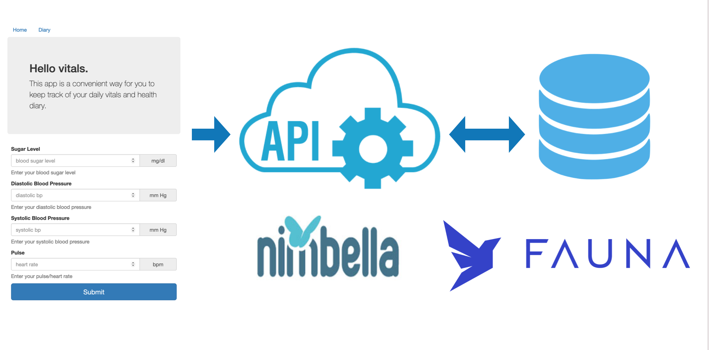
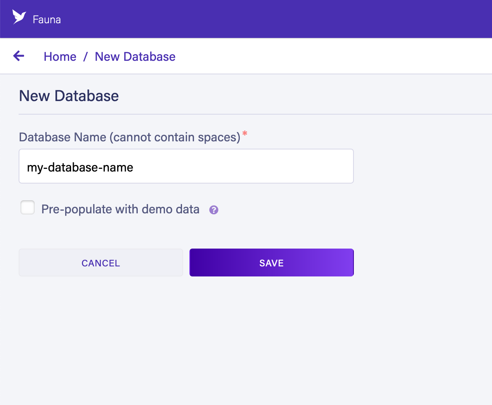
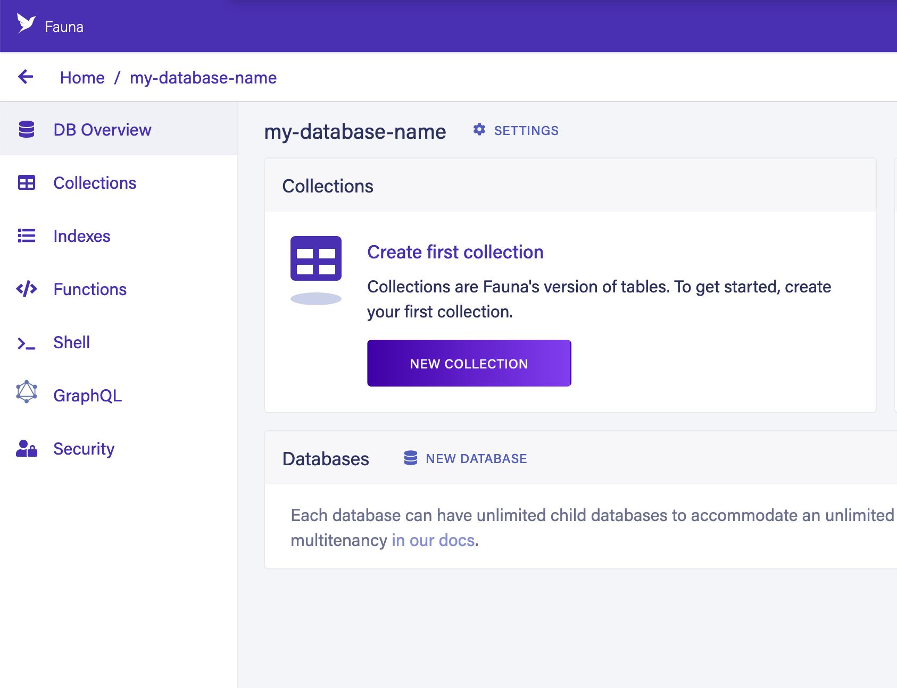
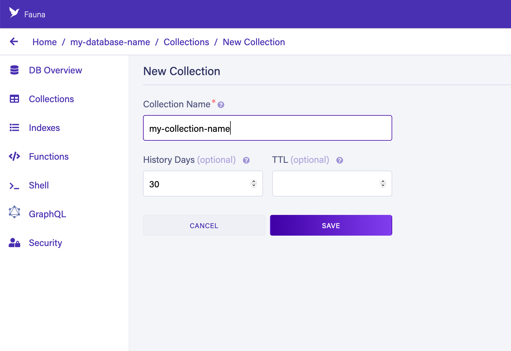
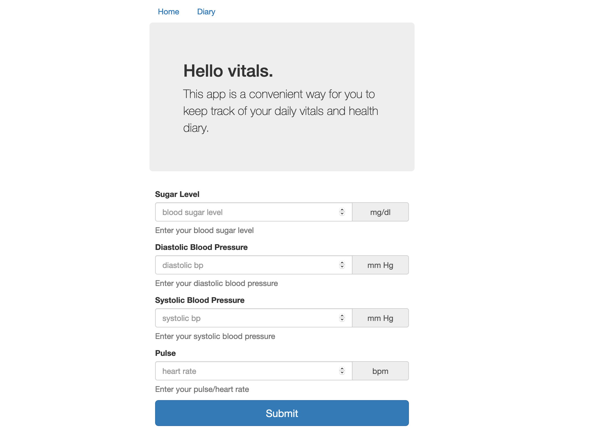
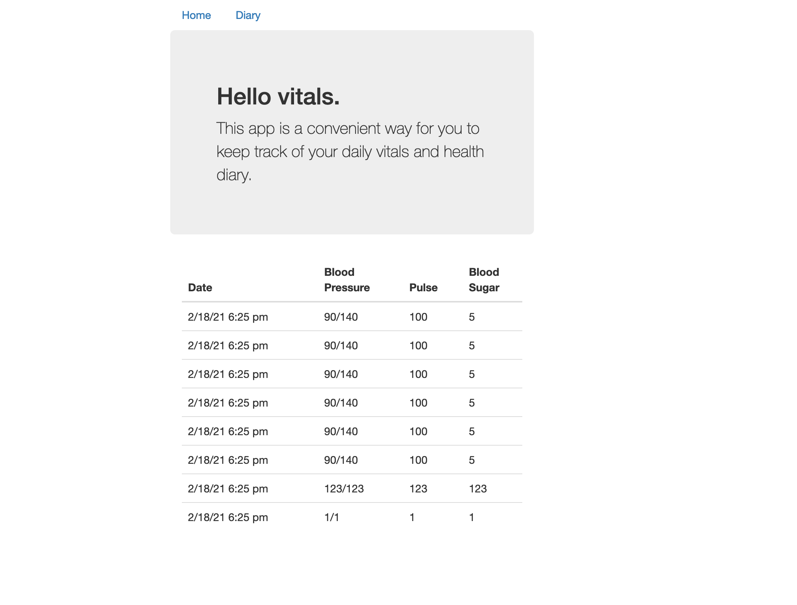

# Hello Vitals.

A stateful serverless web app to record daily vitals. 

API backend and static web assets are hosted by the [Nimbella Platform](https://nimbella.com). It uses [Fauna](https://fauna.com/) as the database. Follow the instructions below to deploy this application in your own Nimbella namespace.



## Set up the database backend

This application uses [Fauna](https://fauna.com/) to store the daily vital measurements. 

[Fauna](https://fauna.com/) is a document database - it stores native JSON object as individual documents. Documents are grouped into Collections. Documents and Collections are be queried using Fauna's custom query language (FQL).

Here is the JSON schema used for the measurements in this web application.

```json
{
  "bp_diastolic": 90,
  "bp_systolic": 140,
  "glucose_level": 5,
  "pulse": 100,
  "timestamp": "2021-02-18 17:04:09"
}
```

Before you can deploy the Nimbella application, you need to sign up for a Fauna account, provision a new database, create a collection and then provision an authentication token. 

### Sign up for a Fauna account

- Visit [fauna.com](https://fauna.com/) and follow the instructions to sign up for an account.

### Provision a new database

- Create a new database in the Fauna dashboard using this link: https://dashboard.fauna.com/db-new/
- Choose a name for the database.
- Click "Save"



### Create a new collection

- Click the "New Collection" button from the database management console.



- Choose a name for the collection
- Click "Save"



### Provision an authentication token

- Click the "Security" link in the database management console.
- Click the "NEW KEY" button.
- Click "SAVE"
- Copy the displayed key secret to your local development environment.


## Update the Nimbella project configuration

- Copy the `.env.template` file to `.env`
- Fill in the environment parameters with your values from above:
  - FAUNADB_COLLECTION="YOUR COLLECTION NAME"
  - FAUNADB_SECRET="SECRET FROM FAUNA CONSOLE"

## Deploy The Nimbella Project

*This step assumes you have [already signed up](https://nimbella.com/signup) for an account with the Nimbella platform, [installed the CLI tool](https://docs.nimbella.com/install) and [configured authentication](https://docs.nimbella.com/namespaces) for your namespace. If you need help with any of these steps please see documentation [here](https://docs.nimbella.com/).*

- Run the project deploy command from your CLI

  ```
  nim project deploy .
  ```

If the deployment was successful, the following logs should be shown:

```
Deploying project '/Users/me/code/nimbella/vitals'
  to namespace '<nim-namespace>'
  on host 'https://apigcp.nimbella.io'
Started running npm install --production in code/vitals/vitals/records
Finished running npm install --production in code/vitals/vitals/records

Deployed 2 web content items to
  https://<nim-namespace>-apigcp.nimbella.io
Deployed actions ('nim action get <actionName> --url' for URL):
  - vitals/records
```

## Using the Web App

- Open the URL displayed in the deployment logs, e.g. `https://<nim-namespace>-apigcp.nimbella.io`. You can also retrieve your URL by running `nim auth current --web`.



- Fill in the form fields and click the "Submit" button.
- The logged vital values should be displayed in the Diary page.

